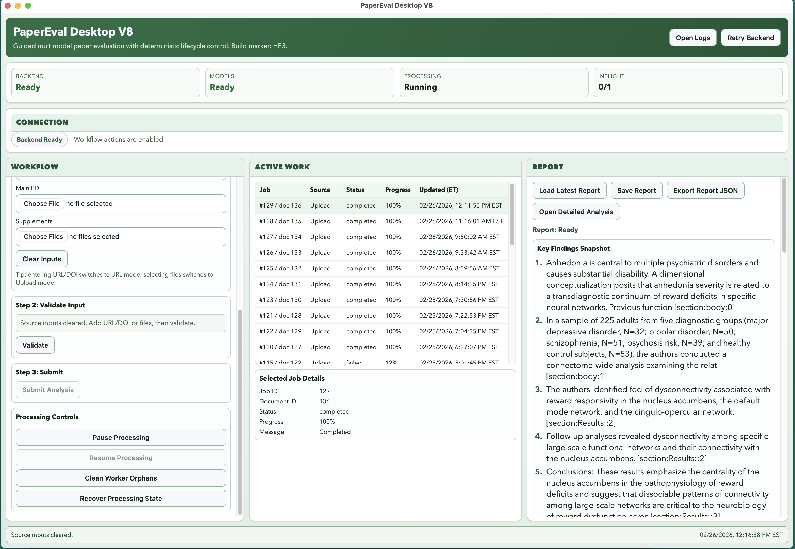
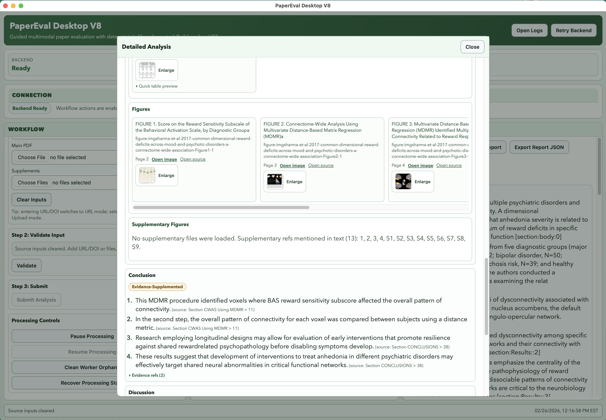

# PsychPaperEvalApp

Desktop + backend pipeline for evaluating psychiatric research papers from URL/DOI or manual PDF upload.

## UI Snapshot

### Main Dashboard



### Detailed Analysis Modal



## Repo Scope

This repository tracks source code, tests, and configuration templates.

It intentionally does **not** track:
- local model weights (`models/*.gguf`, `mmproj`, etc.)
- runtime/job data (`data/`)
- local DB files (`*.db`)
- local env secrets (`backend/.env`)
- build artifacts (`desktop_ui/dist`, `desktop_shell/src-tauri/target`, packaged `.app`)

## Quick Setup

1. Create Python env and install backend deps:
```bash
python3 -m venv .venv
.venv/bin/pip install -r backend/requirements.txt
```
2. Create local env config:
```bash
cp backend/.env.example backend/.env
```
3. Add local model files under `models/` (not tracked by git).
4. Start app/backend:
```bash
./run_app.sh
```

## GitHub Push (first time)

```bash
git remote add origin <YOUR_GITHUB_REPO_URL>
git push -u origin main --tags
```
