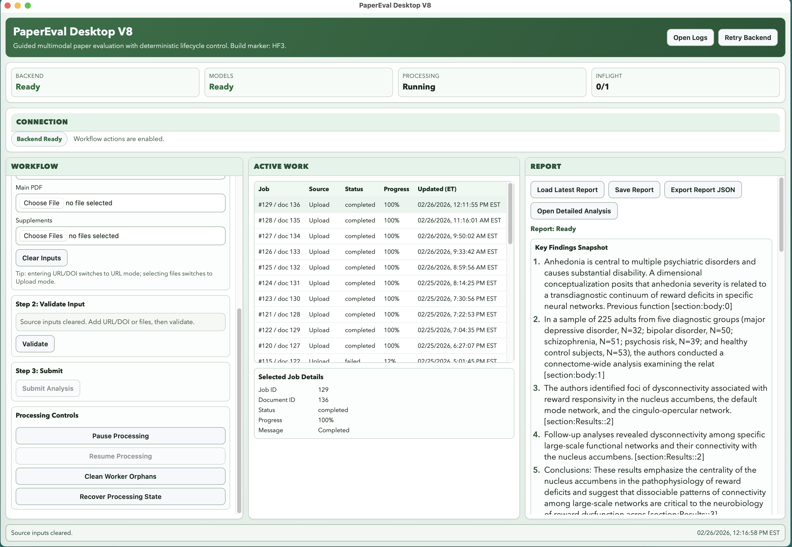
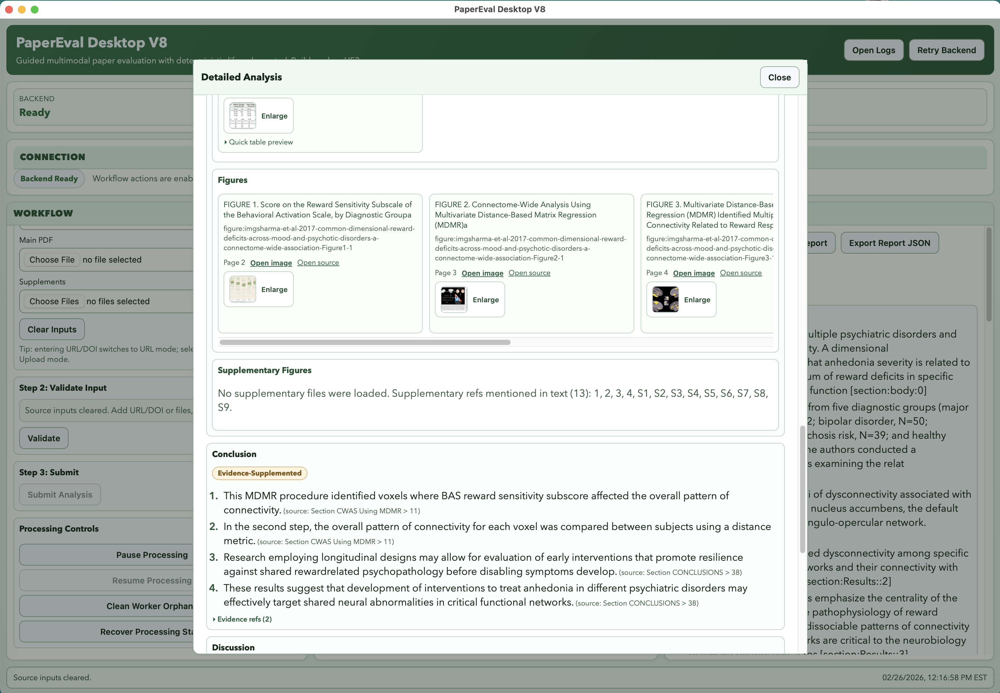

# PsychPaperEvalApp

Desktop + backend pipeline for evaluating psychiatric research papers from URL/DOI or manual PDF upload.

The app parses paper assets, runs section-grounded multimodal analysis, and writes a structured report with diagnostics for model usage, source coverage, and extraction quality.

## UI Snapshot

### Main Dashboard



### Detailed Analysis Modal



## Repo Scope

This repository tracks source code, tests, and configuration templates.

It intentionally does **not** track:
- local model weights (`models/*.gguf`, `mmproj`, etc.)
- runtime/job data (`data/`)
- OpenAI usage ledgers (`data/openai_usage_ledger.jsonl`)
- local DB files (`*.db`)
- local env secrets (`backend/.env`)
- build artifacts (`desktop_ui/dist`, `desktop_shell/src-tauri/target`, packaged `.app`)

## Quick Setup

1. Create Python env and install backend deps:
```bash
python3 -m venv .venv
.venv/bin/pip install -r backend/requirements.txt
```
2. Create local env config:
```bash
cp backend/.env.example backend/.env
```
3. Add local model files under `models/` (not tracked by git).
4. Start app/backend:
```bash
./run_app.sh
```

## LLM Providers

The app supports local `llama.cpp` models and OpenAI API models.

Local mode remains the default unless `LLM_PROVIDER=openai` is configured. Local model weights are expected under `models/` and are not tracked by git.

OpenAI mode uses the Responses API by default:

```env
LLM_PROVIDER=openai
PSYCHPAPER_OPENAI_API_KEY=sk-...
OPENAI_API_MODE=responses
OPENAI_TEXT_MODEL=gpt-5-mini
OPENAI_DEEP_MODEL=gpt-5-mini
OPENAI_VISION_MODEL=gpt-5-mini
OPENAI_REASONING_EFFORT=minimal
```

`gpt-5-mini` is used as the default because it supports text and image input with text output, while keeping paper runs relatively inexpensive. The OpenAI wrapper still preserves the existing app-level `chat_text_fast`, `chat_text_deep`, and `chat_with_images` interfaces.

## OpenAI Cost Guardrails

OpenAI usage is tracked in an append-only JSONL ledger at:

```text
data/openai_usage_ledger.jsonl
```

Each API call creates a reservation before the request and an actual usage record after the response. Reservations use conservative estimates so the run can be stopped before a call would exceed the configured budget. Actual records use token counts returned by OpenAI and are the best local estimate for per-run cost.

Current relevant defaults:

```env
OPENAI_USAGE_GUARDRAILS_ENABLED=true
OPENAI_MAX_COST_PER_RUN_USD=0.15
OPENAI_MAX_COST_PER_DAY_USD=2.00
OPENAI_MAX_CALLS_PER_RUN=36
OPENAI_MAX_OUTPUT_TOKENS_PER_RUN=55000
OPENAI_ESTIMATED_IMAGE_INPUT_TOKENS=2500
LLM_TEXT_MAX_TOKENS=6000
LLM_DEEP_MAX_TOKENS=3500
LLM_VISION_MAX_TOKENS=1200
```

The guardrail is stage-aware and records `job_id`, `document_id`, model, modality, stage, input tokens, cached input tokens, output tokens, and estimated cost. If the next call would exceed the run cap, daily cap, call cap, or output-token cap, analysis fails fast with a budget message rather than silently continuing.

Figure and supplement fallbacks now propagate budget errors instead of retrying through OCR/caption-only paths after the cap is reached.

Recent observed runs validated the local estimate against the OpenAI dashboard:

- Job `146`: local estimate about `$0.0239`; dashboard movement was close after rounding/lag.
- Job `148`: local estimate about `$0.0419`; dashboard moved roughly `$0.05`.

Treat the ledger as the working per-run estimate and the OpenAI dashboard as the final billing source. If the two drift across multiple runs, update `backend/app/services/analysis/openai_usage.py` pricing assumptions.

## Diagnostics

Each completed or failed run writes diagnostics under the document artifact directory:

```text
data/doc_<id>/artifacts/
```

Important files include:

- `parse_diagnostics.json`: parse timing and asset/chunk counts.
- `run_timeline.json`: timestamped pipeline steps with per-step durations.
- `parser_asset_diagnostics.json`: per-asset parse status and count deltas.
- `source_manifest.json`: selected main asset and supplements for uploads/URLs.
- `analysis_diagnostics.json`: stage timings, timestamped analysis timeline, coverage, model call counts, OpenAI usage summary, and vision input diagnostics.
- `error.log`: traceback for failed jobs.

The desktop UI exposes runtime readiness, GROBID health, model provider readiness, model call counts, OpenAI estimated cost/tokens, source coverage, and report diagnostics. Reports with failed OpenAI calls are marked invalid instead of presenting deterministic fallback output as a normal OpenAI result.

## Analysis Pipeline Notes

Relevant current behavior:

- Text, table, figure, supplement, reconcile, and synthesis stages carry usage context for diagnostics.
- For OpenAI runs with subprocess guards enabled, text/table/figure/supplement analysis runs in parallel; reconcile and synthesis wait for all modalities.
- Text analysis runs in guarded subprocesses and refuses OpenAI fallback reports when required OpenAI calls fail.
- Figure analysis skips page-raster fallback images, supports caption-only analysis when image input is unavailable, and keeps OCR fallback bounded.
- Synthesis produces sectioned executive summaries for Introduction, Methods, Results, Discussion, and Conclusion.
- Section fidelity checks reduce cross-section leakage, especially method/result mixing.
- Parser and ingestion write source manifests and richer diagnostics for troubleshooting PDF, upload, URL, and supplement handling.
- Desktop startup now has a longer backend readiness timeout and focuses the existing window on secondary launch instead of unnecessarily recycling the backend.

## Cost Checks

For a completed job:

1. Find the job's `document_id` in `data/app.db`.
2. Read `data/doc_<document_id>/artifacts/analysis_diagnostics.json`.
3. Use `diagnostics.openai_usage.estimated_cost_usd` for actual local cost.
4. Compare with the OpenAI platform daily usage after allowing for dashboard lag and rounding.

Only successful actual ledger entries should be used for cost accounting. Reservations are intentionally conservative and can be much higher than actual cost.

## Git Version Check

Compare the local checkout with GitHub:

```bash
python3 scripts/git_version_report.py --fetch
```

Add `--show-files` only when you want the changed-file list in the output.

## GitHub Push (first time)

```bash
git remote add origin <YOUR_GITHUB_REPO_URL>
git push -u origin main --tags
```
